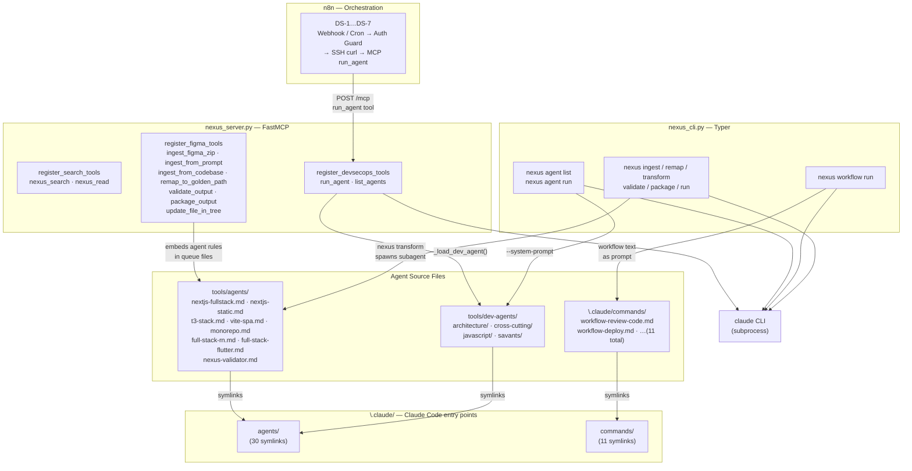
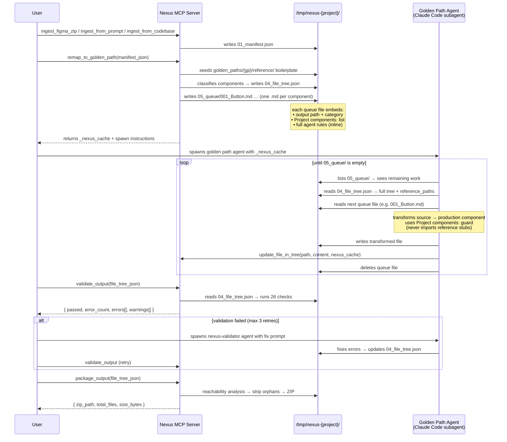
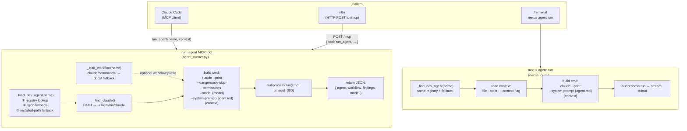
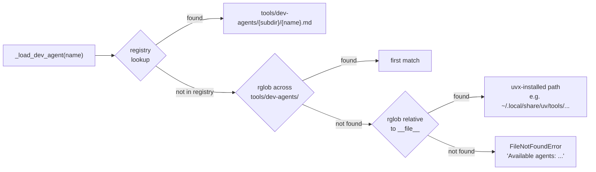
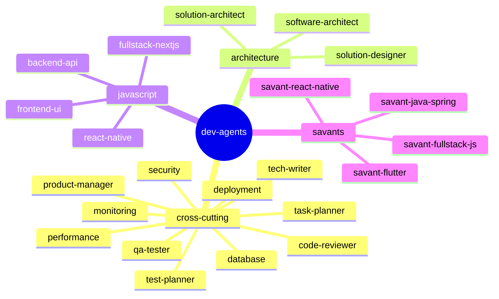
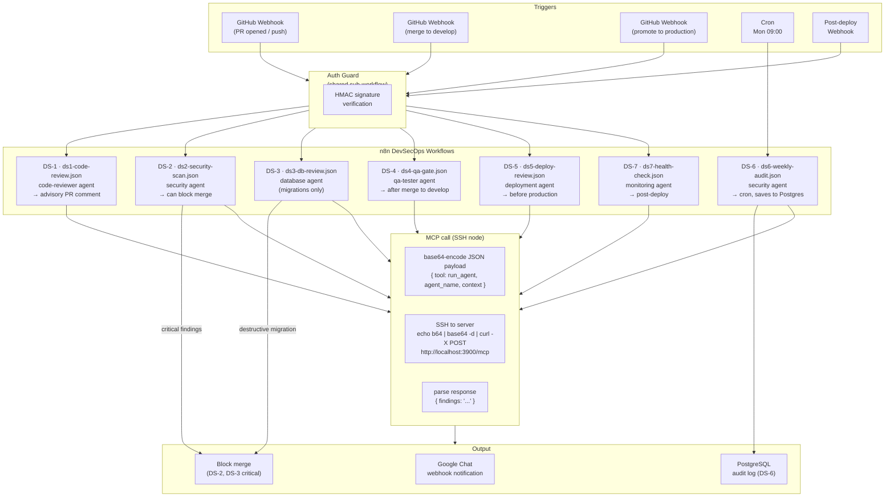
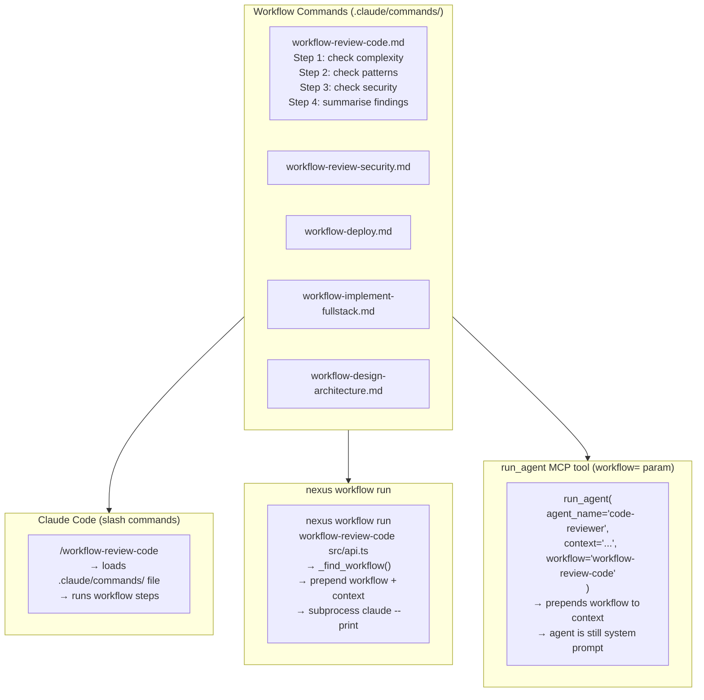
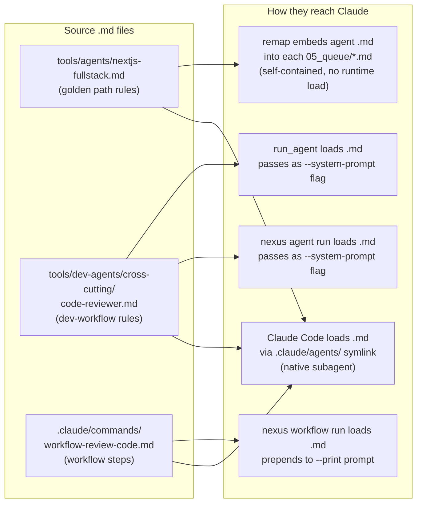

# Agents Architecture Guide

This guide covers the three agent systems in Nexus MCP — how they are structured, how data flows through them, and how they relate to each other.

---

## Three Agent Namespaces

| Namespace | Source | Count | Triggered by | Purpose |
|-----------|--------|-------|--------------|---------|
| **Golden Path** | `tools/agents/` | 8 | `remap_to_golden_path` (MCP) | Figma → production code transformation |
| **Dev-Workflow** | `tools/dev-agents/` | 22 | `run_agent` (MCP) · `nexus agent run` (CLI) | Software Development Lifecycle (SDLC) assistance: review, security, QA, deploy |
| **Workflow Commands** | `.claude/commands/` | 11 | `/workflow-*` (Claude Code) · `nexus workflow run` (CLI) | Multi-step orchestration (design → implement → deploy) |

All three are registered as symlinks in `.claude/agents/` and `.claude/commands/` so Claude Code can invoke them directly. Golden path and dev-workflow agents share the directory but have no name collisions — golden paths use stack names (`nextjs-fullstack`, `t3-stack`) while dev-workflow agents use role names (`code-reviewer`, `security`).

---

## Static Architecture



---

## Golden Path Agent — Data Flow

The golden path agent is invoked as a Claude Code subagent during the LLM transform step. The queue files are self-contained: each one embeds the full agent rules so no external file read is needed during transformation.



### Queue file anatomy

```
05_queue/001_HeroSection.md
─────────────────────────────────────────────────────────
# Transform: HeroSection

**Output path:** app/components/HeroSection.tsx
**Category:** section

**Project components:**
- app/components/HeroSection.tsx
- app/components/NavBar.tsx
- app/components/Footer.tsx

**Agent rules:**
[full contents of tools/agents/nextjs-fullstack.md embedded here]

---

**Source:**
[original Figma Make source code]
```

---

## Dev-Workflow Agent — Data Flow

Dev-workflow agents have two equivalent entry points: the `run_agent` MCP tool (used by n8n and Claude Code) and `nexus agent run` (used from the terminal). Both call the `claude` CLI with the agent markdown as a system prompt.



### Agent loading — fallback chain



The same three-step fallback runs in both `agent_runner.py` (MCP) and `nexus_cli.py` (CLI), ensuring the same agent is found whether running from a dev checkout or a `uvx`-installed distribution.

---

## Dev-Workflow Agent Categories



---

## n8n DevSecOps Pipeline — Data Flow

Seven n8n workflows wire the dev-workflow agents to real CI/CD events. Each workflow follows the same pattern: trigger → auth → extract context → MCP call → parse → notify.



### MCP call anatomy (n8n SSH node)

Each n8n workflow constructs the MCP call as a base64-encoded curl command to avoid shell escaping issues across SSH:

```
JavaScript node → builds JSON payload:
{
  "jsonrpc": "2.0",
  "method": "tools/call",
  "params": {
    "name": "run_agent",
    "arguments": {
      "agent_name": "code-reviewer",
      "context": "<PR diff extracted above>",
      "model": "claude-sonnet-4-6"
    }
  },
  "id": 1
}

SSH node executes:
  B64=$(echo '<json>' | base64 -w0)
  echo "${B64}" | base64 -d | curl -s -X POST http://localhost:3900/mcp \
    -H 'Content-Type: application/json' -d @-
```

The Nexus MCP server has `stateless_http=True` so no prior `initialize` handshake is needed — each call is self-contained.

---

## Workflow Commands — Data Flow

Workflow commands are multi-step orchestration instructions. Unlike agents (which are system prompts), workflow commands are user-level prompts — Claude reads the workflow steps and executes them against the provided context.



The `workflow=` parameter in `run_agent` combines both: the **dev-workflow agent** as a system prompt (role and expertise) and the **workflow command** as structured steps prepended to the user context.

---

## How Agent Rules Reach Claude



---

## Adding a New Dev-Workflow Agent

1. **Write the agent:** `tools/dev-agents/{category}/{name}.md`
2. **Register it:** add `"name": "category"` to `_AGENT_REGISTRY` in `tools/devsecops/agent_runner.py` and `_DEV_AGENT_REGISTRY` in `nexus_cli.py`
3. **Symlink for Claude Code:** `.claude/agents/{name}.md → ../../tools/dev-agents/{category}/{name}.md`
4. **Update `pyproject.toml`** package-data if adding a new category subdirectory
5. **Bump version** and deploy via PyPI (Python files changed)

No changes needed to `nexus_server.py` — `register_devsecops_tools` reads the registry at import time.

---

## Adding a New Workflow Command

1. **Write the workflow:** `.claude/commands/{name}.md` (also copy to `docs/sample-claude-agents/commands/` as reference)
2. **No registration needed** — `_find_workflow` scans `.claude/commands/` by filename
3. Available immediately in Claude Code as `/{name}` and via `nexus workflow run {name}`
