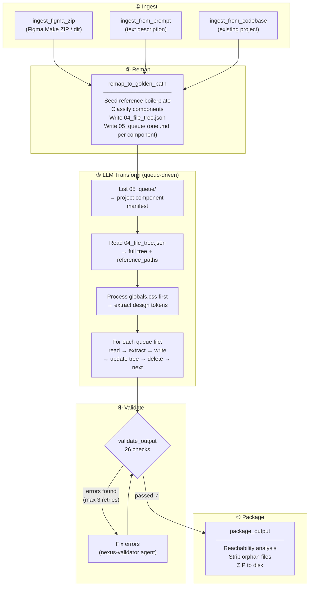

# Nexus — Enterprise Dev Toolkit

> **Design-to-Code pipeline · 22 Software Development Lifecycle (SDLC) agents · Workflow commands · Hybrid search — all powered by Claude Code.**

Nexus is an enterprise dev toolkit with four integrated capabilities:

| Capability | What it does |
|------------|-------------|
| **Design-to-Code Pipeline** | Turn a [Figma Make](https://www.figma.com/make) export, text description, or existing codebase into production-ready code in your chosen stack — via golden path conventions and Claude-powered transformation |
| **Dev-Workflow Agents** | 22 specialized Claude agents covering every SDLC stage: code review, security, QA, deployment, architecture, database, monitoring, and more |
| **Workflow Commands** | 11 multi-step orchestration workflows — design → implement → review → deploy → document |
| **Hybrid Search & Read** | Web search and documentation-optimised reading for AI agents (`nexus_search`, `nexus_read`) |

**Two ways to use Nexus:**

| Mode | How | Best for |
|------|-----|----------|
| **CLI** (`nexus`) | Install via one-liner, run from terminal | Local development, CI scripts, standalone use |
| **MCP server** | Add to Claude Code / n8n / Claude Desktop | AI agent workflows, n8n DevSecOps automation |

---

## Features

### 1. Hybrid Search (`nexus_search`)
- **General mode** — broad web search for news, articles, and general information
- **Docs mode** — filters to technical domains (`readthedocs`, `github`, `stackoverflow`, official docs)

### 2. Intelligent Reading (`nexus_read`)
- **General focus** — cleans articles, strips ads and navigation
- **Code focus** — retains only headers, code blocks, and tables; perfect for API docs
- **Auto-detect** — switches to code focus automatically on technical sites like GitHub

### 3. Design-to-Code Pipeline (7 tools)

Three ways to start, one shared pipeline to finish:



#### How the queue works

`remap_to_golden_path` writes one self-contained `.md` file per component into `05_queue/`. Each queue file embeds:
- The output path, category, and source content
- A **`Project components:`** list — every path that belongs to this pipeline run
- The full golden path agent rules (inline — no external file needed)

The agent reads queue files one at a time, transforms each component, updates `04_file_tree.json`, deletes the queue file, and repeats until `05_queue/` is empty.

The `Project components` list is the key guard: when generating a page or layout, the agent only imports components from this list — never reference boilerplate stubs (e.g. `Features.tsx`, `CTA.tsx`) that appear in the file tree but were not part of the Figma Make source.

| Golden Path | Stack |
|-------------|-------|
| `nextjs-fullstack` | Next.js 16.1, React 19.2, Tailwind v4, tRPC v11, Prisma v7, NextAuth v5, Zustand v5 |
| `nextjs-static` | Next.js 16.1, React 19.2, Tailwind v4, static export |
| `t3-stack` | T3 conventions (src/ layout), tRPC + Prisma + NextAuth + Zustand, Tailwind v4 |
| `vite-spa` | Vite 6, React 19.2, Tailwind v4, React Router v7, TanStack Query |
| `monorepo` | Turborepo, apps/web + apps/marketing, shared packages/ui + packages/db |
| `full-stack-rn` | Turborepo, apps/web (Next.js 16 + Supabase API) + apps/mobile (Expo 54 bare + NativeWind), shared packages |
| `full-stack-flutter` | Turborepo, apps/web (Next.js 16 + Supabase API) + apps/mobile (Flutter 3.32 + Riverpod + go_router), shared packages |

### 4. Dev-Workflow Agents (22 agents)

Specialized Claude Code agents for every stage of the SDLC — code review, security, QA, deployment, architecture, and more. Integrated into Claude Code, the CLI, the MCP server, and n8n DevSecOps workflows.

**Two new MCP tools:**

| Tool | Description |
|------|-------------|
| `run_agent(agent_name, context, workflow?)` | Run a named agent against any content (diff, file, description) |
| `list_agents()` | List all available agents by category |

**Agent categories:**

| Category | Agents |
|----------|--------|
| `cross-cutting` | code-reviewer, security, database, deployment, monitoring, performance, product-manager, qa-tester, task-planner, tech-writer, test-planner |
| `architecture` | software-architect, solution-architect, solution-designer |
| `javascript` | backend-api, frontend-ui, fullstack-nextjs, react-native |
| `savants` | savant-fullstack-js, savant-flutter, savant-java-spring, savant-react-native |

**DevSecOps pipeline alignment (n8n workflows):**

| DS Step | Agent | Trigger |
|---------|-------|---------|
| DS-1 Code Review | code-reviewer | PR webhook |
| DS-2 Security Scan | security | PR webhook |
| DS-3 DB Review | database | PR webhook (migration files only) |
| DS-4 QA Gate | qa-tester | merge to develop |
| DS-5 Deploy Review | deployment | promote to production |
| DS-6 Weekly Audit | security | cron Mon 9am |
| DS-7 Health Check | monitoring | post-deploy |

### 5. Privacy & Cost
- **No API keys required** — uses DuckDuckGo for search and standard HTTP for reading
- **Runs locally** — your data stays on your machine until sent to the LLM

---

## Installation & Integration

Pick the use case that matches what you want to do — each one is self-contained.

---

### I want to generate code from a Figma Make export or prompt

**Prerequisites:** Python 3.10+, [`claude` CLI](https://claude.ai/code) installed and authenticated

```bash
# 1. Install nexus-toolkit
curl -fsSL https://nexus.coderstudio.co/install.sh | bash
# or: pip install nexus-toolkit  /  uv tool install nexus-toolkit

# 2. Install and authenticate Claude Code (required for transform + agent commands)
npm install -g @anthropic-ai/claude-code
claude login

# 3. Run
nexus run prompt "A SaaS dashboard" --golden-path nextjs-fullstack --project-name my-app
nexus run zip ~/Downloads/figma-export.zip --golden-path nextjs-fullstack --project-name my-app
```

---

### I want to use Nexus tools inside a Claude Code session

No separate install needed — `uvx` fetches the package on demand.

```bash
# Add the MCP server
claude mcp add nexus -- uvx --refresh --from nexus-toolkit@latest nexus-mcp

# Verify
claude mcp list   # nexus ✓ Connected
```

All 9 MCP tools are now available in every Claude Code session — pipeline tools (`ingest_figma_zip`, `remap_to_golden_path`, `validate_output`, …) and agent tools (`run_agent`, `list_agents`).

---

### I want to use Nexus in Claude Desktop or Cursor

No separate install needed. Add one entry to your config file and restart the app.

Config file location:
- macOS: `~/Library/Application Support/Claude/claude_desktop_config.json`
- Windows: `%APPDATA%\Claude\claude_desktop_config.json`

```json
{
  "mcpServers": {
    "nexus": {
      "command": "uvx",
      "args": ["--refresh", "--from", "nexus-toolkit", "nexus-mcp"]
    }
  }
}
```

Nexus tools will appear in the tool picker after restart.

---

### I want to automate workflows with n8n

Run Nexus as a persistent HTTP MCP server — your n8n instance calls its tools to automate code review, security scanning, QA gates, and more.

```bash
# Start in HTTP mode (uvx — no prior install needed)
MCP_TRANSPORT=http MCP_HOST=0.0.0.0 MCP_PORT=3900 uvx --from nexus-toolkit nexus-mcp
```

In n8n, set the MCP Client node **Endpoint URL** to:

```
http://<server-ip>:3900/mcp
```

Nexus tools (`run_agent`, pipeline tools, `nexus_search`) are then callable from any n8n workflow node.

---

### Development install (contribute / modify)

```bash
git clone https://github.com/rcdelacruz/nexus-toolkit.git
cd nexus-toolkit
uv sync   # or: python3 -m venv .venv && source .venv/bin/activate && pip install -e .
```

---

## Updating

### Auto-update (recommended for uvx setups)

Add `--refresh` to your uvx command once — Nexus checks PyPI on every startup and updates automatically when a new version is available.

**Claude Code:**
```bash
claude mcp add nexus -- uvx --refresh --from nexus-toolkit@latest nexus-mcp
```

**Claude Desktop / Cursor** — edit your config:
```json
{
  "mcpServers": {
    "nexus": {
      "command": "uvx",
      "args": ["--refresh", "--from", "nexus-toolkit", "nexus-mcp"]
    }
  }
}
```

> `--refresh` adds ~1–2 seconds at startup while uvx checks PyPI. If no new version is available, it starts immediately.

### Manual update

| Integration | Command |
|---|---|
| **CLI** (pip / uv tool) | `pip install --upgrade nexus-toolkit` or `uv tool upgrade nexus-toolkit` |
| **Claude Code / Desktop / Cursor** (uvx) | `uvx --reinstall --from nexus-toolkit nexus-mcp` then restart the app |
| **n8n HTTP server** (persistent process) | `uvx --reinstall --from nexus-toolkit nexus-mcp` then restart the process |

---

## Usage

### CLI (`nexus`)

The `nexus` CLI lets you run the full Design-to-Code pipeline from the terminal — no MCP client required. It ships alongside the MCP server in the same package.

#### Prerequisites

- `nexus-mcp` installed (any method from [Installation](#installation))
- [`claude` CLI](https://claude.ai/code) installed and authenticated (required for the transform step)

#### Claude CLI lookup order

The `nexus transform` command finds `claude` in this order:

1. `--claude-path <path>` flag
2. `CLAUDE_PATH` environment variable
3. System `PATH` (`which claude`)
4. `~/.local/bin/claude` (standard Claude Code install on macOS/Linux)

#### Commands

**Design-to-Code Pipeline**

| Command | Description |
|---------|-------------|
| `nexus run zip <zip>` | Full pipeline: ingest → remap → transform → validate → package |
| `nexus run prompt "<desc>"` | Full pipeline from a text description |
| `nexus run codebase <dir>` | Full pipeline from an existing codebase |
| `nexus ingest zip <zip>` | Ingest step only — produces `01_manifest.json` |
| `nexus ingest prompt "<desc>"` | Ingest step only |
| `nexus ingest codebase <dir>` | Ingest step only |
| `nexus remap <project>` | Seed boilerplate + write transformation queue |
| `nexus transform <project>` | Process queue files with Claude (LLM step) |
| `nexus validate <project>` | Run 26 checks on generated files |
| `nexus package <project>` | Package output into a ZIP |

Pipeline commands read/write to `/tmp/nexus-<project-name>/` automatically.

**Dev-Workflow Agents**

| Command | Description |
|---------|-------------|
| `nexus agent list` | List all 22 available agents grouped by category |
| `nexus agent run <name> [file]` | Run a named agent against a file, stdin (`-`), or `--context` |

Available agents: `code-reviewer` · `security` · `database` · `deployment` · `monitoring` · `performance` · `product-manager` · `qa-tester` · `task-planner` · `tech-writer` · `test-planner` · `backend-api` · `frontend-ui` · `fullstack-nextjs` · `react-native` · `software-architect` · `solution-architect` · `solution-designer` · `savant-fullstack-js` · `savant-flutter` · `savant-java-spring` · `savant-react-native`

**Workflow Commands**

| Command | Description |
|---------|-------------|
| `nexus workflow run <name> [file]` | Run a multi-step workflow against a file, stdin (`-`), or `--context` |

Available workflows: `workflow-review-code` · `workflow-review-security` · `workflow-review-performance` · `workflow-deploy` · `workflow-design-architecture` · `workflow-design-nextjs` · `workflow-implement-backend` · `workflow-implement-frontend` · `workflow-implement-fullstack` · `workflow-qa-e2e` · `workflow-write-docs`

**Utility**

| Command | Description |
|---------|-------------|
| `nexus update` | Upgrade to the latest version from PyPI |
| `nexus version` | Print current version |
| `nexus --help` | Show all commands and options |

#### Step-by-step workflow

```bash
# 1. Ingest
nexus ingest zip ~/Downloads/mydesign.zip \
  --golden-path nextjs-fullstack \
  --project-name myapp

# 2. Seed boilerplate + generate queue
nexus remap myapp --prompt "add dark mode support"

# 3. LLM transformation (calls claude CLI automatically)
nexus transform myapp

# 4. Validate
nexus validate myapp

# 5. Package
nexus package myapp --output-dir ~/Desktop/
```

#### One-liner (full pipeline)

```bash
nexus run zip ~/Downloads/mydesign.zip \
  --golden-path nextjs-fullstack \
  --project-name myapp \
  --output-dir ~/Desktop/

nexus run prompt "A SaaS dashboard with sidebar nav, stats cards, and a data table" \
  --golden-path nextjs-fullstack \
  --project-name my-saas

nexus run codebase ~/Projects/old-react-app \
  --golden-path nextjs-fullstack \
  --project-name migrated-app
```

> **Note:** `nexus run` is fully automated — ingest → remap → claude transform → validate → package with no manual steps. Requires `claude` CLI installed and authenticated.

#### Options reference

**`nexus run *` / `nexus transform`**

| Flag | Short | Default | Description |
|------|-------|---------|-------------|
| `--golden-path` | `-g` | required | Target stack (`nextjs-fullstack`, `nextjs-static`, `t3-stack`, `vite-spa`, `monorepo`, `full-stack-rn`, `full-stack-flutter`) |
| `--project-name` | `-p` | `my-app` | Output project slug |
| `--prompt` | — | — | Extra instructions passed to the LLM agent (e.g. `"use Inter font"`) |
| `--model` | `-m` | `claude-sonnet-4-6` | Claude model to use for transformation |
| `--claude-path` | — | _(auto-detect)_ | Explicit path to the `claude` CLI |
| `--output-dir` | `-o` | _(stays in `/tmp/`)_ | Copy the final ZIP to this directory |

**`nexus agent run` / `nexus workflow run`**

| Flag | Short | Default | Description |
|------|-------|---------|-------------|
| `--context` | `-c` | — | Inline context string instead of a file |
| `--model` | `-m` | `claude-sonnet-4-6` | Claude model to use |
| `--claude-path` | — | _(auto-detect)_ | Explicit path to the `claude` CLI |

Pass a file path as the second argument, or `-` to read from stdin:

```bash
# file
nexus agent run security src/auth.ts

# stdin
git diff HEAD~1 | nexus agent run code-reviewer -

# inline
nexus agent run deployment --context "$(cat docker-compose.yml)"

# workflow + file
nexus workflow run workflow-review-security src/api/routes.ts
```

#### Environment variables

| Variable | Description |
|----------|-------------|
| `CLAUDE_PATH` | Path to the `claude` CLI binary (overridden by `--claude-path`) |

---

### MCP (Claude Code / n8n)

The MCP server exposes all tools across all four capabilities. The CLI and MCP server share the same codebase.

| MCP tool group | Tools |
|----------------|-------|
| Search & Read | `nexus_search` · `nexus_read` |
| Design-to-Code Pipeline | `ingest_figma_zip` · `ingest_from_prompt` · `ingest_from_codebase` · `remap_to_golden_path` · `validate_output` · `package_output` · `update_file_in_tree` |
| Dev-Workflow Agents | `run_agent` · `list_agents` |

---

### Search & Read

```
How do I use asyncio.gather in Python? Check the docs.
```
Nexus calls `nexus_search(mode="docs")` then `nexus_read(focus="code")` — you get only the function signature and examples, not the surrounding prose.

---

### Design-to-Code Pipeline

#### Starting point A — Figma Make export

If you have a Figma Make export unzipped locally:
```
I have a Figma Make export at /Users/me/Downloads/figma-export.
Turn it into a Next.js fullstack app called "dashboard-app".
```

Or provide the ZIP as base64:
```bash
base64 -i figma-export.zip | pbcopy   # macOS — copy to clipboard
```
```
Here is my Figma Make export as base64: <PASTE>
Project name: dashboard-app, golden path: nextjs-fullstack
```

#### Starting point B — Text description (no Figma Make file needed)

```
Build a SaaS landing page with a hero section, features grid, pricing table,
testimonials, and footer. Use nextjs-static. Call it "my-landing".
```

Nexus calls `ingest_from_prompt`, infers the components from your description, and queues each one for the LLM agent to create from scratch.

For a bare scaffold with no UI:
```
Scaffold a clean nextjs-fullstack starter called "my-app". No design yet.
```

#### Starting point C — Existing project migration

```
Migrate my existing React app at /Users/me/projects/old-app
to nextjs-fullstack conventions. Call the output "new-app".
```

Nexus calls `ingest_from_codebase`, reads your source files, skips config/tooling (golden path boilerplate replaces those), and queues each component for the agent to rewrite to golden path standards while preserving UI and logic.

#### Finishing the pipeline

In all three cases, Claude chains the pipeline automatically:
1. Ingestion tool produces a manifest
2. `remap_to_golden_path` seeds boilerplate + queues components for the agent
3. The golden path agent transforms each component
4. `validate_output` checks for errors (broken imports, missing files, etc.)
5. `package_output` zips everything up

```bash
# The ZIP is saved to disk automatically — Claude will show the zip_path
cp /tmp/nexus-my-app/my-app.zip ~/Desktop/
unzip ~/Desktop/my-app.zip && cd my-app
pnpm install && pnpm dev
```

---

## Tool Reference

### Search tools

#### `nexus_search(query, mode?)`
| Parameter | Type | Default | Description |
|-----------|------|---------|-------------|
| `query` | string | required | Search query |
| `mode` | string | `"general"` | `"general"` or `"docs"` |

#### `nexus_read(url, focus?)`
| Parameter | Type | Default | Description |
|-----------|------|---------|-------------|
| `url` | string | required | URL to fetch |
| `focus` | string | `"auto"` | `"general"`, `"code"`, or `"auto"` |

---

### Pipeline tools

#### `ingest_figma_zip(zip_base64?, project_dir?, golden_path, project_name?)`
Reads a Figma Make export — either as a base64 ZIP string or a local directory path. Classifies files into components, pages, styles, and assets.

| Parameter | Type | Description |
|-----------|------|-------------|
| `zip_base64` | string | Base64-encoded ZIP from Figma Make |
| `project_dir` | string | Path to an already-unzipped Figma Make directory |
| `golden_path` | string | Target stack (see golden paths table above) |
| `project_name` | string | Output project slug (default: `"my-app"`) |

Provide either `zip_base64` **or** `project_dir`, not both.

---

#### `ingest_from_prompt(description, golden_path, project_name?, pages?, components?)`
Generates a pipeline manifest from a text description — no Figma file needed.

| Parameter | Type | Description |
|-----------|------|-------------|
| `description` | string | Natural language description of what to build |
| `golden_path` | string | Target stack |
| `project_name` | string | Output project slug (default: `"my-app"`) |
| `pages` | string[] | Optional explicit page names, e.g. `["HomePage", "AboutPage"]`. Auto-inferred if omitted. |
| `components` | string[] | Optional explicit component names, e.g. `["HeroSection", "Footer"]`. Auto-inferred if omitted. |

Use this for:
- **Scaffold only** — short description like `"scaffold a nextjs-static starter"` with no pages/components → produces boilerplate with no queued UI work
- **Description-driven** — describe the UI you want → components are inferred and created from scratch by the agent

---

#### `ingest_from_codebase(project_dir, golden_path, project_name?)`
Migrates an existing project to a golden path.

| Parameter | Type | Description |
|-----------|------|-------------|
| `project_dir` | string | Absolute path to the existing project root |
| `golden_path` | string | Target stack to migrate toward |
| `project_name` | string | Output project slug (default: source directory name) |

Config and tooling files (`package.json`, `tsconfig.json`, etc.) are automatically excluded — the golden path boilerplate versions replace them. Source components and pages are queued for the agent to rewrite to golden path conventions while preserving UI and logic.

Skips: `node_modules`, `.next`, `dist`, `build`, `generated`, `.git`, `.turbo`, and other build output directories.

---

#### `remap_to_golden_path(manifest_json, user_prompt?)`
Seeds the golden path reference boilerplate, classifies Figma/prompt/codebase files, and writes one queue file per component for the LLM agent to process.

| Parameter | Type | Description |
|-----------|------|-------------|
| `manifest_json` | string | JSON returned by any of the three ingestion tools |
| `user_prompt` | string | Optional extra instructions, e.g. `"use Inter font"`, `"add dark mode"` |

**Input:** manifest from any ingestion tool
**Output:** `_nexus_cache` pointer + instructions to spawn the golden path agent

---

#### `validate_output(file_tree_json)`
Runs static analysis on the generated file tree before packaging. Checks for:
- Missing required files (per `manifest.json`)
- Broken `@/` imports
- Leftover Figma Make artifacts (`React.FC`, bare `import React`, inline styles)
- Missing `"use client"` on components that use hooks or event handlers
- Default exports in `components/` (should be named exports)
- `oklch()` color usage (must be `hsl()`)
- `tailwind.config` references (disallowed in Tailwind v4)
- Hardcoded hex colors in TSX files
- `process.env` in `vite-spa` (must be `import.meta.env.VITE_*`)
- Unsafe browser globals (`localStorage`, `sessionStorage`) without SSR guards
- `console.log/warn/error` calls left in production code
- Orphan files, duplicate paths, unprocessed queue files

**Input:** summary JSON from `remap_to_golden_path`
**Returns:** `{ "passed": bool, "error_count": N, "warning_count": N, "errors": [...], "warnings": [...] }`

---

#### `package_output(file_tree_json)`
Zips the generated file tree into an archive on disk. Orphan files (unreachable from entry points and not config/passthrough) are automatically stripped before packaging.

**Input:** summary JSON from `remap_to_golden_path`
**Returns:** `{ "zip_path": "/tmp/nexus-<name>/<name>.zip", "total_files": N, "stripped_files": [...], "files": [...], "size_bytes": N, "instructions": "..." }`

---

#### `update_file_in_tree(path, content, nexus_cache)`
Writes a transformed file's content back into the cached file tree. Intended for API-only clients (e.g. n8n) that cannot write to the filesystem directly.

| Parameter | Type | Description |
|-----------|------|-------------|
| `path` | string | Relative file path matching the queue item (e.g. `"components/ui/button.tsx"`) |
| `content` | string | Fully transformed file content |
| `nexus_cache` | string | `_nexus_cache` value from `remap_to_golden_path` (e.g. `"/tmp/nexus-my-app"`) |

**Note:** The standard Claude Code pipeline writes files directly using its own file tools — this tool is only needed by headless/API integrations.

---

### Dev-workflow agent tools

#### `run_agent(agent_name, context, workflow?, model?)`
Run a named dev-workflow agent against any content (diff, file content, description, etc.) using the `claude` CLI. Returns structured findings as JSON.

| Parameter | Type | Default | Description |
|-----------|------|---------|-------------|
| `agent_name` | string | required | Agent to invoke (e.g. `"code-reviewer"`, `"security"`, `"deployment"`) |
| `context` | string | required | Content to analyze — PR diff, file content, endpoint list, etc. |
| `workflow` | string | `""` | Optional slash-command workflow to prepend as instructions (e.g. `"workflow-review-code"`) |
| `model` | string | `"claude-sonnet-4-6"` | Claude model to use |

**Available agent names:** `code-reviewer`, `security`, `database`, `deployment`, `monitoring`, `performance`, `product-manager`, `qa-tester`, `task-planner`, `tech-writer`, `test-planner`, `backend-api`, `frontend-ui`, `fullstack-nextjs`, `react-native`, `software-architect`, `solution-architect`, `solution-designer`, `savant-fullstack-js`, `savant-flutter`, `savant-java-spring`, `savant-react-native`

**Returns:** `{ "agent": "...", "workflow": "...", "findings": "...", "model": "..." }`

---

#### `list_agents()`
List all available dev-workflow agents organized by category.

**Returns:** `{ "agents": { "cross-cutting": [...], "architecture": [...], "javascript": [...], "savants": [...] }, "total": 22, "categories": [...] }`

---

## Project Structure

```
nexus-mcp/
├── nexus_server.py              # MCP server entry point (nexus-mcp)
├── nexus_cli.py                 # CLI entry point (nexus)
├── tools/
│   ├── search.py                # nexus_search + nexus_read
│   ├── figma/
│   │   ├── __init__.py          # Registers all pipeline tools
│   │   ├── ingest.py            # ingest_figma_zip
│   │   ├── prompt_ingest.py     # ingest_from_prompt
│   │   ├── codebase_ingest.py   # ingest_from_codebase
│   │   ├── remap.py             # remap_to_golden_path
│   │   ├── validate.py          # validate_output
│   │   ├── package.py           # package_output
│   │   └── filetree.py          # update_file_in_tree
│   ├── devsecops/
│   │   ├── __init__.py          # Registers dev-workflow tools
│   │   └── agent_runner.py      # run_agent + list_agents
│   ├── agents/                  # Per-golden-path LLM transformation agents
│   │   ├── nextjs-fullstack.md
│   │   ├── nextjs-static.md
│   │   ├── t3-stack.md
│   │   ├── vite-spa.md
│   │   ├── monorepo.md
│   │   ├── full-stack-rn.md
│   │   ├── full-stack-flutter.md
│   │   └── nexus-validator.md
│   └── dev-agents/              # Dev-workflow agents (SDLC assistance)
│       ├── architecture/        # software-architect, solution-architect, solution-designer
│       ├── cross-cutting/       # code-reviewer, security, database, deployment, monitoring, ...
│       ├── javascript/          # backend-api, frontend-ui, fullstack-nextjs, react-native
│       └── savants/             # savant-fullstack-js, savant-flutter, savant-java-spring, ...
├── golden_paths/
│   ├── nextjs-fullstack/
│   │   ├── manifest.json        # Stack metadata, routing, required files, classification rules
│   │   └── reference/           # Boilerplate seeded at pipeline start
│   ├── nextjs-static/
│   ├── t3-stack/
│   ├── vite-spa/
│   ├── monorepo/
│   ├── full-stack-rn/           # Next.js web + Expo mobile monorepo
│   └── full-stack-flutter/      # Next.js web + Flutter mobile monorepo
├── .claude/
│   ├── agents/                  # Symlinks → tools/agents/ and tools/dev-agents/
│   └── commands/                # Slash-command workflows (workflow-review-code, etc.)
├── n8n-workflow/                # n8n workflow JSON exports (source of truth)
│   ├── ds1-code-review.json     # DS-1: Code review on PR
│   ├── ds2-security-scan.json   # DS-2: Security scan on PR
│   ├── ds3-db-review.json       # DS-3: DB migration review
│   ├── ds4-qa-gate.json         # DS-4: QA gate on merge to develop
│   ├── ds5-deploy-review.json   # DS-5: Deploy review before production
│   ├── ds6-weekly-audit.json    # DS-6: Weekly security audit (cron)
│   ├── ds7-health-check.json    # DS-7: Post-deploy health check
│   └── ...                      # Existing Nexus pipeline workflows
├── tests/
│   ├── test_figma_pipeline.py
│   ├── test_nexus_server.py
│   ├── test_improvements.py     # 83 unit/integration tests
│   └── test_mcp_protocol.py     # MCP protocol-layer tests
├── pyproject.toml
└── README.md
```

---

## Testing

```bash
# Run all tests
uv run pytest tests/ -v

# Run only pipeline tests
uv run pytest tests/test_figma_pipeline.py -v

# Run only server tests
uv run pytest tests/test_nexus_server.py -v

# Run pipeline improvement tests (41 tests)
uv run pytest tests/test_improvements.py -v

# Run MCP protocol tests (17 tests)
uv run pytest tests/test_mcp_protocol.py -v
```

---

## Further Reading

| Document | Purpose |
|----------|---------|
| [CHANGELOG.md](CHANGELOG.md) | Version history and release notes |
| [AGENTS_GUIDE.md](AGENTS_GUIDE.md) | Architecture and data flow for all three agent systems (golden path, dev-workflow, n8n DevSecOps) |
| [GOLDEN_PATH_GUIDE.md](GOLDEN_PATH_GUIDE.md) | Decision tree and use-case profiles for choosing a golden path |
| [ADDING_GOLDEN_PATHS.md](ADDING_GOLDEN_PATHS.md) | How to add a new golden path or extend to other languages/frameworks |
| [MAINTENANCE.md](MAINTENANCE.md) | Version upkeep, quarterly sweep process, known breaking patterns |
| [VERIFICATION.md](VERIFICATION.md) | Step-by-step server connection and tool verification |

---

## Contributing

Contributions are welcome. Please ensure:
- All tests pass: `uv run pytest tests/`
- New features include tests
- Version changes in `reference/package.json` are reflected in the corresponding `.claude/agents/{name}.md` Stack table (see `MAINTENANCE.md`)

---

## License

MIT License — see [LICENSE](LICENSE) for details.
